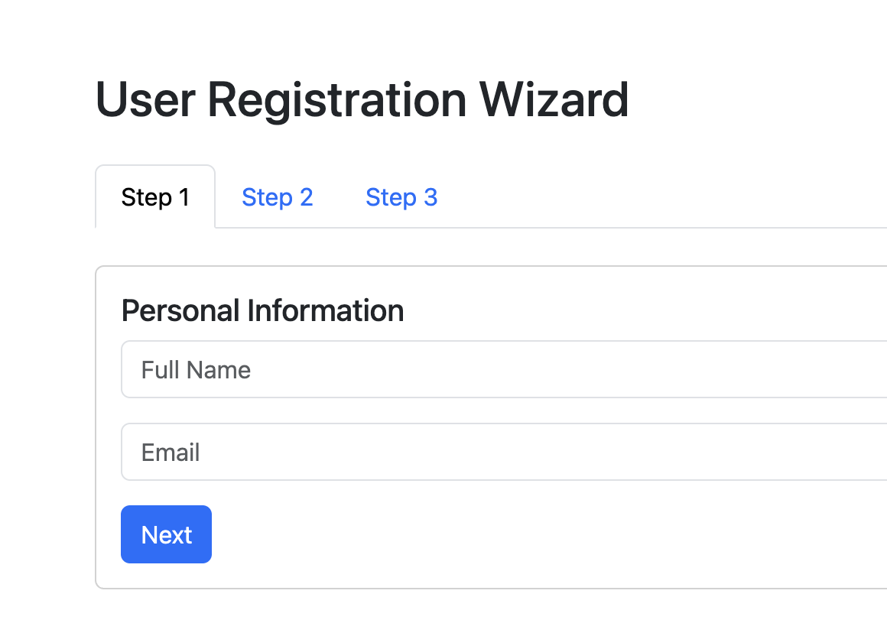

# Step 3: Personal Information Step

## Bootstrap Forms

Bootstrap provides styled form controls.

Example: `form-control`

This class applies consistent styling to:

- Text inputs
- Email fields
- `textarea`
- `select` elements

Useful form classes:

| Class | Purpose |
| --- | --- |
| `form-control` | Styled input |
| `form-label` | Form label |
| `form-select` | Styled select |
| `form-check` | Checkbox and radio layout |

## Reference

- [Bootstrap Forms](https://getbootstrap.com/docs/5.3/forms/overview/)

## Bootstrap Buttons

Buttons are styled using the `btn` class.

Example: `btn btn-primary`

Important variants:

| Class | Purpose |
| --- | --- |
| `btn-primary` | Main action |
| `btn-secondary` | Secondary action |
| `btn-success` | Success state |
| `btn-danger` | Destructive action |

## Reference

- [Bootstrap Buttons](https://getbootstrap.com/docs/5.3/components/buttons/)

## Task: Add Step 1 content - A Form with text and buttons

Replace the tab content of the first step with a form that includes a `card` div with: 

- Title: `Personal Information`
- Two textboxes for `name` and `email`
- A button to naviage to the next step

```html
<div class="tab-pane fade show active" id="step1">
	<div class="card">
		<div class="card-body">
			<h5 class="card-title">Personal Information</h5>

			<input class="form-control mb-3" id="name" placeholder="Full Name">
			<input class="form-control mb-3" id="email" placeholder="Email">

			<button class="btn btn-primary" onclick="nextStep(2)">Next</button>
		</div>
	</div>
</div>
```

Expected output:



[< Back to Step 2](step2.md) | Step 3 | [Go to Step 4 >](step4.md)
