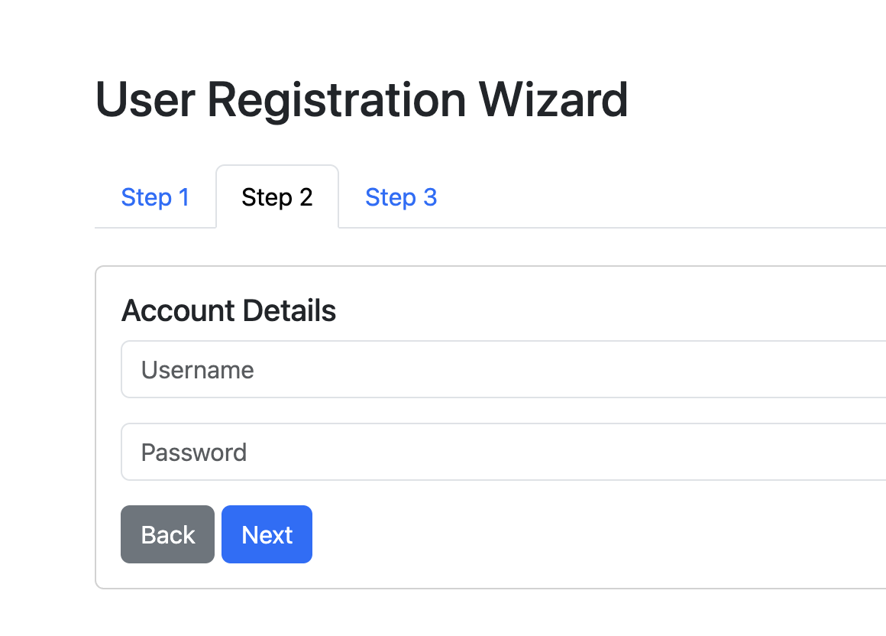

# Step 4: Adding Account Details Step

## Task: Add Step 2 content 

For the second step, add the code to include a `card` that meets the following requirements:

- Include a title: `Account Details`
- Allow the user to set a `username` using a textbox
- Allow the user to set a `password` using a textbox
- Include a button that lets the user go back to the previous step
- Include a button that allows the user to go the next step

Expected output:

[< Back to Step 3](step3.md) | Step 4 | [Go to Step 5 >](step5.md)
