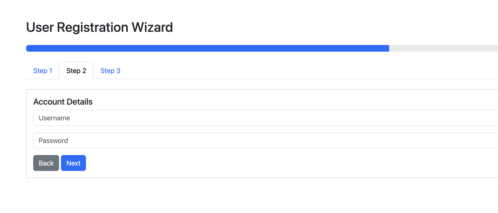

# 10. Improving the Wizard with Progress Indicators

## Bootstrap Progress Component

Structure:

- `progress`
- `progress-bar`

Useful Classes:

| Class | Purpose |
| --- | --- |
| `progress-bar-striped` | striped pattern |
| `progress-bar-animated` | animated stripes |
| `bg-success` | custom color |

### Reference

- [Bootstrap Progress](https://getbootstrap.com/docs/5.3/components/progress/)

## Task 10.1: Add a Progress Bar Above the Wizard

Between the `alert-area` and `wizard` divs, add the following one:

```html
<div class="progress mb-4">
	<div id="wizardProgress" class="progress-bar" style="width: 33%"></div>
</div>
```

## Task 10.2: Update Progress in JavaScript

Create a new function in your `wizard.js` script:

```javascript
function updateProgress(step) {
	let progress = document.getElementById("wizardProgress");
	let percent = (step / 3) * 100;

	progress.style.width = percent + "%";
}
```

## Task 10.3: Call the method

Call the new function inside `nextStep()` and `previousStep()` methods.

## Task 10.4 Verify the implementation

Click on each tab to see the progress update:



[< Back to Step 9](step9.md)

