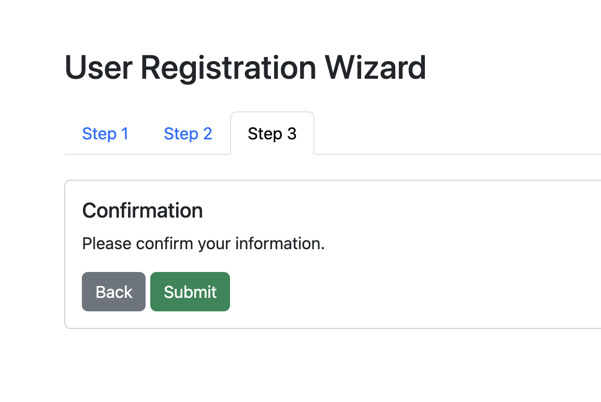

# Step 5: Confirmation Step

## Task: Add Step 3 content 

For the third and final step, add the code to include a `card` that meets the following requirements:

- Include a title: `Confirmation`
- Include a paragraph element: `Please confirm your information`
- Include a button that sends the user back to the previous step
- Include a button that allows the user to submit the form

Expected output:

[< Back to Step 4](step4.md) | Step 5 | [Go to Step 6 >](step6.md)
