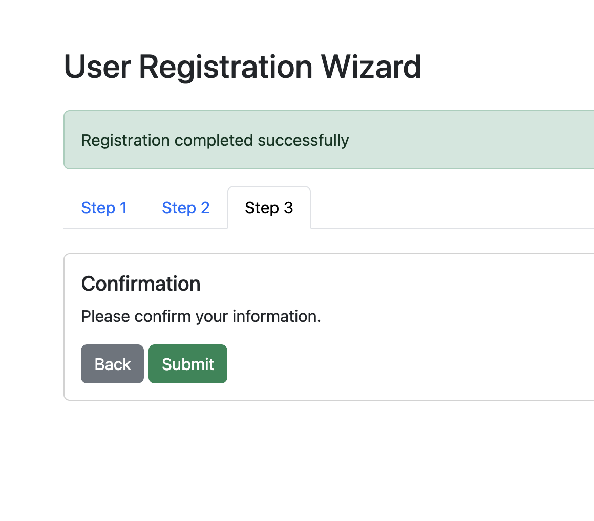

# 9. Submitting the Form

## Task: Submit the Form

Use the `submitForm` method in the `wizard.js` script to display a `success` alert with the message `Registration completed successfully`

Expected output:

[< Back to Step 8](step8.md) | Step 9 | [Go to Step 10 >](step10.md)
